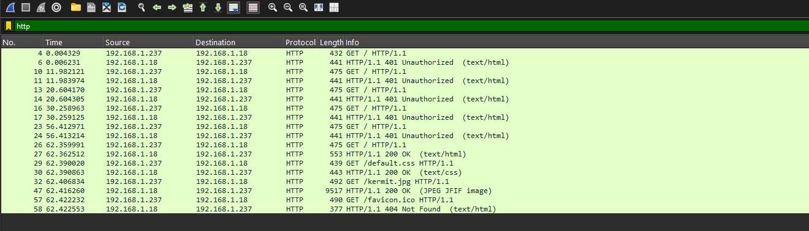
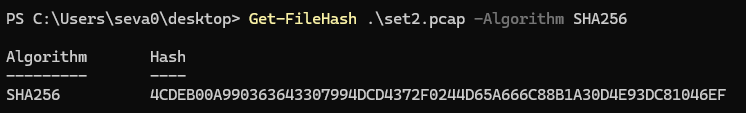

# Network Traffic Analysis: Incident Report
**Security Analyst (Independent Study) 2025/2026**

## 1. Executive Summary
During a targeted network traffic analysis, a **Brute-Force attack** was identified against a web server's authentication mechanism. The attacker successfully compromised the account `lilith` after multiple failed attempts using various password permutations.

* **Incident Type**: Brute-Force / Credential Theft
* **Severity**: **High** (Account Compromise)
* **Attacker IP**: `192.168.1.237`
* **Target IP**: `192.168.1.18`
* **Protocol**: HTTP (Basic Authentication)

---

## 2. Technical Analysis & Findings
The analysis was performed on a 101 KB packet capture (`set2.pcap`) from the "Packet Sleuth" forensics lab. 

### Attack Methodology
1.  **Reconnaissance**: The attacker initiated a `GET /` request (Packet #4), which the server challenged with a `401 Unauthorized` response, revealing the use of **HTTP Basic Authentication**.
2.  **Brute-Force Execution**: The attacker then systematically attempted to authenticate using a dictionary of credentials.
3.  **Plaintext Vulnerability**: Because HTTP Basic Authentication was used without TLS encryption, all credentials were transmitted in **plaintext** (Base64 encoded), allowing for direct extraction during deep-packet analysis.

### Evidence Table
| Packet | Username | Password | Status | Evidence Link |
| :--- | :--- | :--- | :--- | :--- |
| 10 | `lilith` | `i narius` | 401 Unauthorized | [View Screenshot](screenshots/attempt_10.png) |
| 13 | `paris` | `ThatsHot!` | 401 Unauthorized | [View Screenshot](screenshots/attempt_13.png) |
| 16 | `alucard` | `Dracula` | 401 Unauthorized | [View Screenshot](screenshots/attempt_16.png) |
| 23 | `lilith` | `!narius!` | 401 Unauthorized | [View Screenshot](screenshots/attempt_23.png) |
| **26** | **`lilith`** | **`Inarius`** | **200 OK (Success)** | [View Screenshot](screenshots/success_26.png) |

---

## 3. Visual Timeline
Below is the chronological flow of the attack as seen in Wireshark:

---

## 4. Strategic Mitigation Recommendations
To harden the infrastructure and prevent future credential theft, the following measures are recommended:

* **Enforce HTTPS (TLS 1.3)**: Transition from HTTP to HTTPS to encrypt all traffic, preventing the exposure of credentials in transit.
* **Account Lockout Policy**: Implement a mechanism to lock accounts or throttle IP addresses after 3-5 failed login attempts.
* **Multi-Factor Authentication (MFA)**: Deploy MFA to ensure that compromised passwords alone are insufficient for unauthorized access.
* **Deprecate Basic Auth**: Move towards modern authentication frameworks like **OAuth2** or **OpenID Connect**.

---

## 5. Artifacts & Integrity
* **Raw Evidence**: Located in the [`/evidence`](./evidence) directory.
* **Integrity Check (SHA-256)**: `4CDEB00A9903636343307994DCD4372F0244D65A666C88B1A30D4E93DC81046F`.
 

 

---
### Tools Used
* **Wireshark**: Deep-packet analysis and protocol dissection.
* **PowerShell**: SHA-256 file integrity verification.
* **GitHub**: Version control and project documentation.
